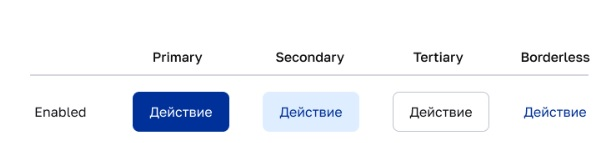
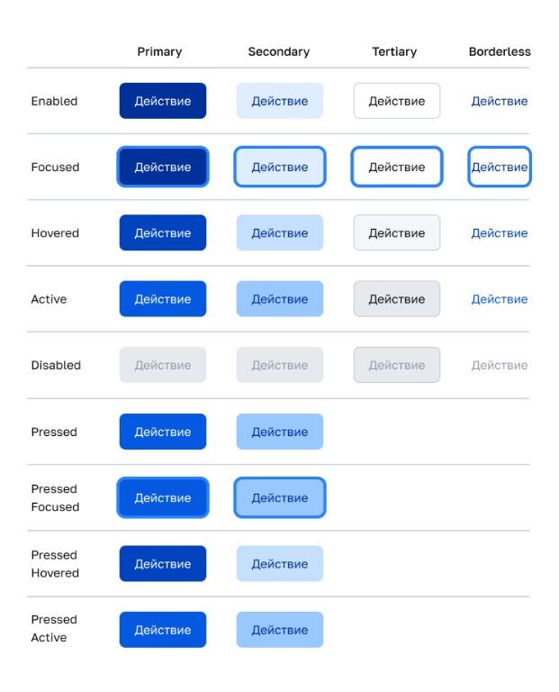

# Компонент: Кнопка (Button)
---

## Содержание
1. [Обзор](#1-обзор)
2. [Внешний вид](#2-внешний-вид)
3. [Состояния](#3-состояния)
4. [Размеры](#4-размеры)
5. [Рекомендации по формулировкам и содержанию](#5-рекомендации-по-формулировкам-и-содержанию)
6. [Таблица свойств компонента](#6-таблица-свойств-компонента)
7. [Дополнительные рекомендации и полезные сведения](#7-дополнительные-рекомендации-и-полезные-сведения)
- [Что полезно добавить в документацию](#что-полезно-добавить-в-документацию)
- [Уточняющие вопросы](#уточняющие-вопросы)

---

## 1. Обзор

### Назначение  
Кнопка — интерактивный элемент интерфейса, предназначенный для взаимодействия пользователя с системой. Используется в формах, диалогах и других сценариях.

### Когда использовать  
- Основные действия формы, например "Сохранить", "Отправить", "Продолжить".  
- Второстепенные действия, такие как "Отменить", "Назад", "Скрыть".  
- Переключатель состояний "Включено/Выключено".
- Элементы управления, такие как "Сортировка", "Фильтр" и т.д.

### Когда не использовать  
- В качестве ссылки, чтобы не вводить пользователя в заблуждение.  
- Как элемент оформления без возможности взаимодействия.
---

## 2. Внешний вид

Компонент поддерживает четыре визуальных типа, отражающих иерархию действий:

| Тип (`kind`)       | Описание |
|---------------------|----------|
| `primary`           | Кнопка основного действия на странице/форме. |
| `secondary`         | Второстепенная кнопка. Подходит для действий типа "Отменить", "Назад". |
| `tertiary`          | Минимально выраженная кнопка. Подходит для дополнительных действий. |
| `borderless`        | Кнопка без границ и фона. |

Визуальное представление



❗ **Важно:** Тип кнопки необходимо указывать явно.

---

## 3. Состояния

Компонент поддерживает следующие состояния:

| Состояние      | Описание |
|----------------|----------|
| **Enabled**    | Обычное активное состояние. Кнопка доступна для взаимодействия. |
| **Focused**    | Кнопка обозначена как текущий элемент для взаимодействия. |
| **Hovered**      | Курсор мыши находится над кнопкой. |
| **Active**     | Пользователь нажал на кнопку, но еще не отпустил ее.|
| **Disabled**   | Кнопка неактивна. Действие недоступно. |
| **Pressed**    | Кнопка нажата и сохраняет это состояние ("включено"). Необходимо для реализации кнопок, работающих по принципу "Включено/Выключено". |
| **Pressed Focused**    | Кнопка в состоянии "Включено" выделена как текущий элемент взаимодействия. |
| **Pressed Hovered**    | Курсор находится на кнопкой в состоянии "Включено". |
| **Pressed Active**    | Кнопка в состоянии "Включено" нажата (но пользователь еще не отпустил кнопку мыши). |
| **Loading**    | Кнопка уже нажата, процесс выполнения действия запущен. |

Ниже приведены визуализации состояний для различных стилей компонента.




## 4. Размеры

Размер кнопки определяется параметром `size` и может принимать значения:

| Размер  (`size`)   | Использование |
|------------------|---------------|
| `large`          | На мобильных устройствах или для ключевых действий. |
| `medium`         | Рекомендуется для большинства случаев. |
| `small`          | В компактных интерфейсах: таблицах, фильтрах и т.д. |

Высоту кнопки можно указать в числовом значении, используя свойство `vertSize`, например `vertSize="40"`.

---

## 5. Рекомендации по формулировкам и содержанию

- Используйте глаголы действия. Например: "Сохранить", "Оплатить", "Загрузить", "Подтвердить".  
- Длина текста не более двух слов.
- Иконки и бейджи можно размещать как справа, так и слева от текста. 

---

## 6. Таблица свойств компонента

У компонента есть следующие свойства:

| Свойство         | Тип | Описание |
|------------------|----------------|----------|
| `kind`           | `string`       |Тип кнопки: `primary`, `secondary`, `tertiary`, `borderless`. |
| `size`           | `string`       | Размер: `large`, `medium`, `small`. |
 `vertSize`           | `int`       | Высота кнопки в числовом представлении. |
| `loading`        | -      | Кнопка была нажата, и операция находится в процессе выполнения. Кнопка неактивна. |
| `loadingMessage` | `string`       | Текст, отображаемый в процессе выполнения операции. |


**Примеры использования (React)**:
> ```jsx
> <Button kind="primary" vertSize="40" loading loadingMessage="Проверяем данные">
>   Продолжить
> </Button>
> ```

> ```jsx
> <Button kind="secondary">
>   Отменить
> </Button>
> ```

---

## 7. Дополнительные рекомендации и полезные сведения

- Рекомендуется проверять внешний вид страницы/формы, когда кнопка находится в состоянии *Loading*.

## Что полезно добавить в документацию

- Указать значение в пикселях для значений размеров `large`, `medium`, `small`, а также рекомендации по применению.
- Добавить описание для использования компонента в мобильной версии.

## Уточняющие вопросы

- Уточнить информацию о состоянии кнопки *Loading*. Каким визуально выглядит данное состояние?
- Уточнить про параметры `size` и `vertSize`. Можно ли указать только число, обозначающее пиксели? Или возможно указание размера в `%` и других единицах?
